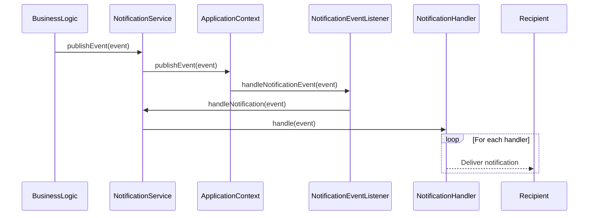
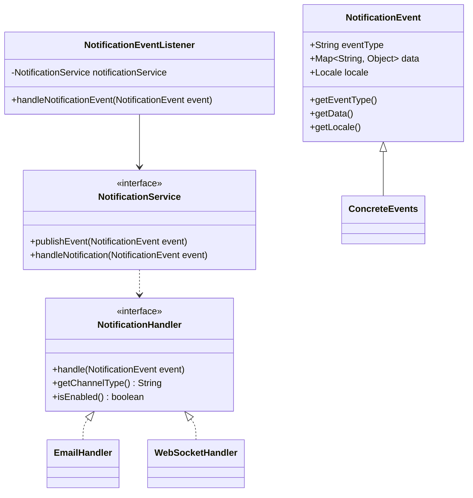

# Notification System Design

## Overview
The notification system is built on Spring's ApplicationEvent mechanism, providing an event-driven architecture for delivering notifications through multiple channels. The system is designed for extensibility and asynchronous processing.

## Core Components

### NotificationEvent
Abstract base class for all notification events:
```java
public abstract class NotificationEvent extends ApplicationEvent {
    private final String eventType;
    private final Map<String, Object> data;
    private final Locale locale;
    
    // Constructor and getters
}
```

### NotificationService
Central service interface:
```java
public interface NotificationService {
    void publishEvent(NotificationEvent event);
    void handleNotification(NotificationEvent event);
}
```

### NotificationEventListener
Listens for and processes events asynchronously:
```java
@Component
public class NotificationEventListener {
    @Async
    @EventListener
    public void handleNotificationEvent(NotificationEvent event) {
        notificationService.handleNotification(event);
    }
}
```

### NotificationHandler
Interface for channel-specific handlers:
```java
public interface NotificationHandler {
    void handle(NotificationEvent event);
    String getChannelType();
    boolean isEnabled();
}
```

## Sequence Diagram


## Class Diagram


## Key Design Patterns
1. **Observer Pattern**: Event publishing/listening through Spring's ApplicationEvent
2. **Strategy Pattern**: Different notification handlers implement a common interface
3. **Template Method Pattern**: NotificationEvent base class defines common structure

## Extension Points
1. **New Event Types**: Extend NotificationEvent with domain-specific events
2. **New Channels**: Implement NotificationHandler for new delivery channels
3. **Localization**: Use locale property for localized message templates
4. **Conditional Handling**: Add custom logic to isEnabled() implementations

## Known Limitations
1. Template management implementation not available
2. Concrete handler implementations not documented
3. Event persistence mechanism not specified
