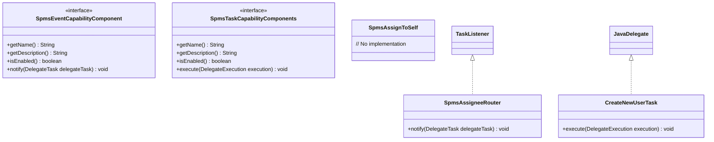

# SPMS Capability Service Documentation

## Package :
com.spms.backend.service.process.capability

## Overview
The Capability Service provides an extensible framework for enhancing Flowable BPMN engine functionality with custom business logic. It allows developers to create reusable capability components that can be integrated into business processes.

## Class Diagram



**Note**: Some implementations (e.g., assignment capabilities) currently deviate from the intended design pattern. See Known Issues section for details.

## Architecture
The service follows a modular architecture with:
- **Interfaces** defining capability contracts
- **Concrete implementations** providing specific functionality
- **Spring component-based** organization
- **Flowable integration** through standard interfaces (`TaskListener`, `JavaDelegate`)

## Key Interfaces

### SpmsEventCapabilityComponent
```java
public interface SpmsEventCapabilityComponent extends TaskListener {
    String getName();
    String getDescription();
    boolean isEnabled();
}
```
- Extends Flowable's `TaskListener`
- Provides metadata about the capability
- Used for event-driven capabilities (task assignment, notifications)

### SpmsTaskCapabilityComponents
```java
public interface SpmsTaskCapabilityComponents extends JavaDelegate {
    String getName();
    String getDescription();
    boolean isEnabled();
}
```
- Extends Flowable's `JavaDelegate`
- Used for service task implementations
- Provides metadata about the capability

## Known Issues

### Implementation Deviations
1. **SpmsAssigneeRouter**:
   - Implements `TaskListener` directly instead of extending `AbstractEventCapabilityComponent`
   - Missing implementations for `getName()`, `getDescription()`, and `isEnabled()`
   - Contains debug output (`System.out.println("hello")`)

2. **SpmsAssignToSelf**:
   - Empty implementation with no functionality
   - Does not implement `TaskListener` or `SpmsEventCapabilityComponent`

### Recommendations
1. Refactor implementations to extend appropriate abstract classes
2. Implement all required interface methods
3. Remove debug statements from production code
4. Add unit tests to verify interface contract compliance

## Capability Categories

### Event Capabilities
1. **Assignment**
   - `SpmsAssigneeRouter`: Routes task assignments (partial implementation)
   - `SpmsAssignToSelf`: Assigns task to current user (not implemented)
   - `SpmsAssignToDepartmentHead`: Assigns to department head
   - `SpmsAssignToFunctionalDepartmentHead`: Assigns to functional department head
   - `SpmsAssignToProcessStarter`: Assigns to process initiator

2. **Notification**
   - `SpmsNotifyAllParticipator`: Notifies all participants
   - `SpmsNotifyEnagagedParticipator`: Notifies engaged participants

### Task Capabilities
1. **User Management**
   - `CreateNewUserTask`: Creates new users
   - `UnlockAadAccountTask`: Unlocks AAD accounts

## Implementation Example
```java
@Slf4j
public class SpmsAssigneeRouter implements TaskListener {
    @Override
    public void notify(DelegateTask delegateTask) {
        String assigneeExpression = delegateTask.getAssignee();
        delegateTask.setAssignee("tester");
        delegateTask.setInProgressStartDueDate(new Date());
        System.out.println("hello");
    }
}
```

**Note**: This example shows the current implementation pattern, which deviates from the intended design by implementing `TaskListener` directly instead of extending `AbstractEventCapabilityComponent`.

## Directory Structure
```
capability/
├── event/
│   ├── AbstractEventCapabilityComponent.java
│   ├── SpmsEventCapabilityComponent.java
│   ├── SpmsTaskCreateListener.java
│   ├── assignment/
│   │   ├── SpmsAssigneeRouter.java
│   │   ├── SpmsAssignToDepartmentHead.java
│   │   ├── SpmsAssignToFunctionalDepartmentHead.java
│   │   ├── SpmsAssignToProcessStarter.java
│   │   └── SpmsAssignToSelf.java
│   └── notify/
│       ├── SpmsNotifyAllParticipator.java
│       └── SpmsNotifyEnagagedParticipator.java
├── inspector/
├── listener/
└── task/
    ├── AbstractIntegrationDelegate.java
    ├── AbstractTaskCapabilityComponents.java
    ├── SpmsTaskCapabilityComponents.java
    ├── message/
    └── users/
        ├── CreateNewUserTask.java
        └── UnlockAadAccountTask.java
```

## Integration with BPMN
Capabilities are integrated into Flowable processes through:
1. **Task Listeners** for event handling
2. **Service Tasks** for task execution

Example BPMN usage:
```xml
<serviceTask id="createUserTask" 
             name="Create User"
             flowable:class="com.spms.backend.service.process.capability.task.users.CreateNewUserTask" />
```

## Best Practices
1. Implement the appropriate interface (`SpmsEventCapabilityComponent` or `SpmsTaskCapabilityComponents`)
2. Use `@Component` annotation for Spring bean registration
3. Provide meaningful names and descriptions
4. Implement enable/disable functionality
5. Follow the existing package structure for organization

### Troubleshooting
- If a capability doesn't work as expected:
  1. Verify the class implements the required interface
  2. Check that all interface methods are implemented
  3. Confirm the class is annotated with `@Component`
  4. Ensure the capability is enabled (`isEnabled()` returns true)
  5. Check application logs for errors or warnings

### Verification Checklist
- [ ] Interface methods implemented
- [ ] Abstract base classes utilized (where appropriate)
- [ ] No debug statements in production code
- [ ] Component annotation present
- [ ] Enable/disable functionality working
- [ ] Unit tests covering basic functionality
