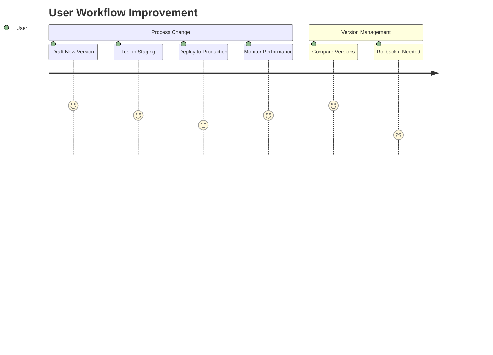

# Product Context

## Enhanced Capabilities

### Process Version Management
- **Safe Process Evolution**: Version control for business processes
- **Parallel Development**: Multiple versions in development simultaneously  
- **Instant Rollback**: Revert to previous stable versions in one click
- **Audit Trail**: Full history of process changes

### Form Management
- **Versioned Forms**: Track form schema changes over time
- **Schema Validation**: Ensure backward compatibility
- **Deprecation Workflow**: Gracefully phase out old versions

## Business Value
1. **Risk Reduction**:
   - No more "big bang" process changes
   - Controlled rollout of process improvements
2. **Operational Flexibility**:
   - Test process variations in production
   - Quickly adapt to regulatory changes
3. **Continuous Improvement**:
   - Measure version performance
   - Iterative process optimization

## User Benefits

## Technical Differentiators
1. **Integrated Flowable Engine**: Direct version deployment
2. **Semantic Versioning**: Clear version progression
3. **Atomic Operations**: Version activation without downtime
4. **Fine-grained Access Control**: Scope-based API security
