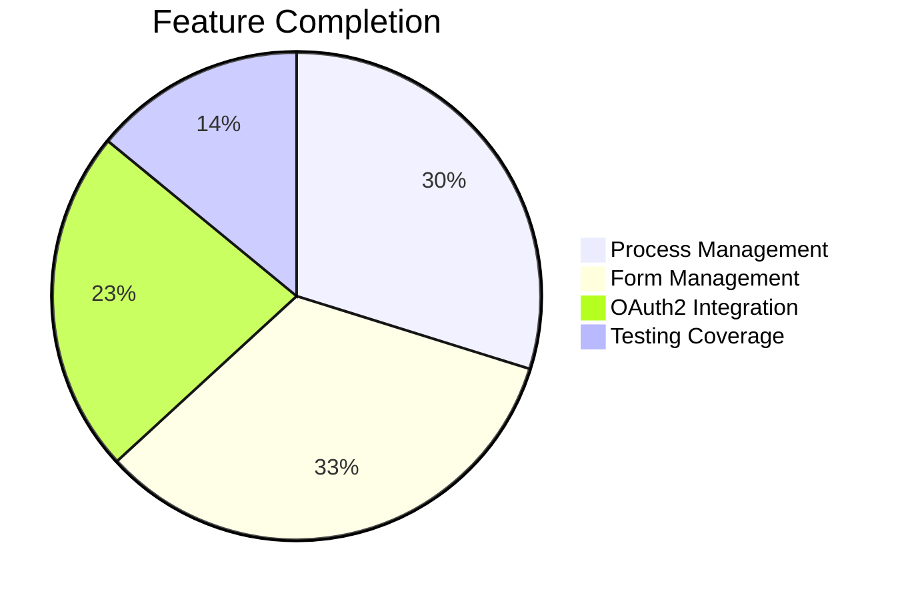
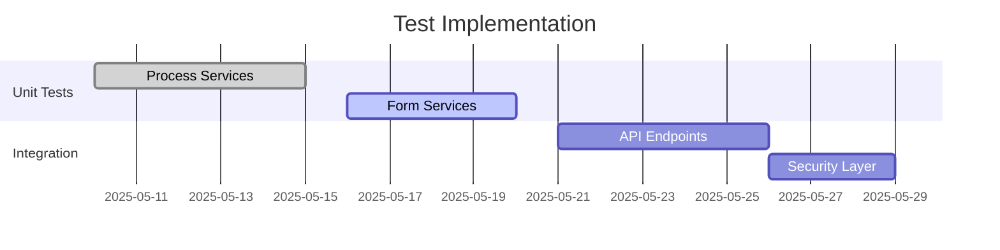

# Progress Tracking

## Implementation Status

### Completed Features
1. **Process Versioning**
   - Version creation API
   - Activation/deactivation
   - BPMN deployment to Flowable
2. **Form Management**
   - Versioned form storage
   - Schema validation
   - Deprecation workflow
   - Logging for key operations
3. **OAuth2 Foundation**
   - Spring Security configuration
   - Provider integration
   - Basic role mapping

### In Progress
1. **Process UI**
   - Version comparison in ProcessVersionDialog
   - Activation status indicators
2. **OAuth2 Enhancements**
   - Scope-based authorization
   - Process API security integration

### Pending Implementation
1. Process version rollback
2. Bulk form version operations
3. OAuth2 token refresh handling

### Testing Coverage

### Known Issues
1. Flowable deployment timeout under load
2. Form schema migration between versions
3. OAuth2 role mapping edge cases
