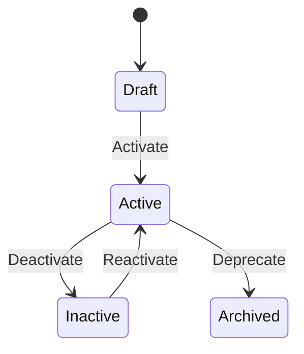
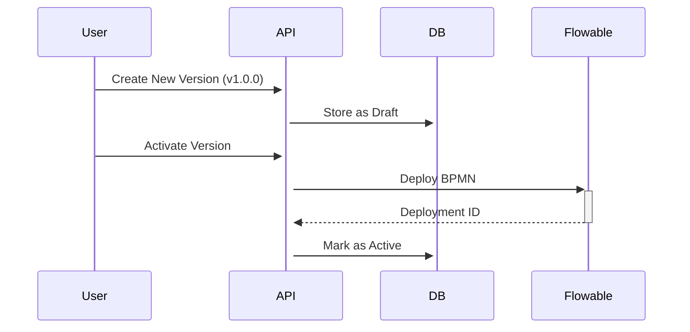
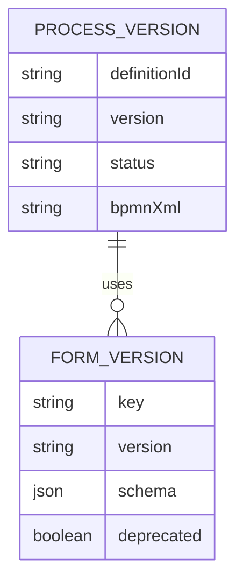

# System Architecture Patterns

## Process Management

### State Management

### Version Control Flow

### Process-Form Relationship

## Security Integration
- Process APIs require `process:read` or `process:write` scopes
- Form management requires `form:manage` scope
- Version activation requires `process:deploy` scope
